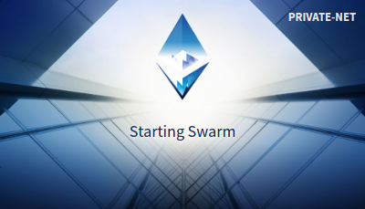
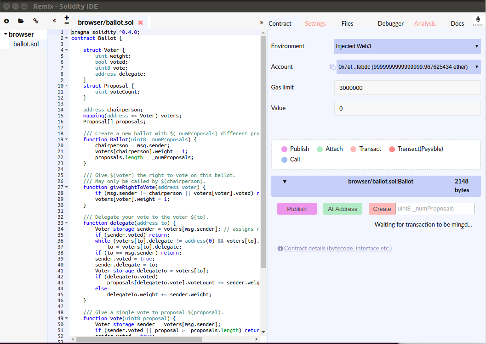
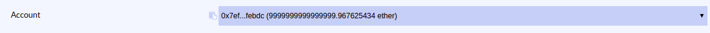
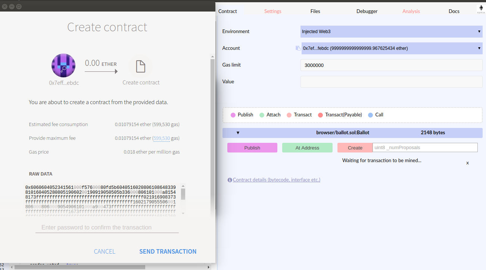
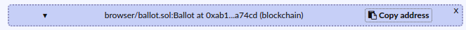

.. _using-mist: 

Using Mist
==========

This guide and the previous one (Using Geth) replace `the original Medium post <https://blog.cosmos.network/using-ethermint-with-geth-and-mist-d4b7715abbd9>`__.

Start by reviewing the `getting started guide <./getting-started.html>`__. Ensure you have both ``tendermint`` and ``ethermint`` installed. See their versions:

::

        tendermint version
        ethermint version

This tutorial was written with tendermint v0.10.4 and ethermint v0.5.0.

Initialization
--------------

Ethermint
^^^^^^^^^

We'll use a recently introduced flag to simultaneously initialize ``tendermint`` under the hood:

::

        ethermint --datadir ~/.ethermint --with-tendermint init

The above command will create a handful of files in ``~/.ethermint``; you should investigate them. Of particular note is the default account in ``~/.ethermint/keystore``. Its password is ``1234`` and we'll be using that later.

Mist
^^^^

The fastest way to get started is by `downloading the right package for your OS <https://github.com/ethereum/mist/releases>`__. For example, on Linux, the ``Mist-linux64-0-9-0.deb`` file was downloaded followed by ``sudo dpkg -i Mist-linux64-0-9-0.deb``. Check that ``mist`` is installed:

::

        mist --version

The ``README`` in the `Mist repository <https://github.com/ethereum/mist>`__ is helpful for debugging installation or installing from source. For this tutorial, mist v0.9.0 was used.

Run It
------

In one window, start ``ethermint``:

::

        ethermint --with-tendermint --datadir ~/.ethermint --rpc --rpcaddr=0.0.0.0 --ws --wsaddr=0.0.0.0 --rpcapi eth,net,web3,personal,admin

and note the ``--with-tendermint`` flag, which also starts the ``tendermint`` process under the hood.

In another terminal window, start ``mist``:

::

        mist --rpc http://localhost:8545

The ``--rpc http://localhost:8545`` option will connect mist to the ``ethermint`` node rather than the main net. You can see this from the ``PRIVATE-NET`` displayed in the app starting up:

Deploy It
---------

The previous ``mist`` command will open one or more windows as apps on your screen. We haven't downloaded the wallet yet, so its functionality is not available. There is, however, still lots we can do. To start, we can go to the Mist Menu Bar and select ``Develop => Open Remix IDE`` which will open browser solidity for compiling and deploying smart contracts. It'll look something like: 

Looking at the right-hand sidebar under ``Account``, we should see:

which is the default account mentioned at the beginning of this tutorial. Let's work with this account since it already has ether.

The ``ballot.sol`` contract is pre-loaded into Remix and we can deploy it as-is for illustration purposes. This can be done by clicking the ``Create`` button which will launch a popup:

Go ahead and enter ``1234`` as the password; the contract will be mined! Recall that this is the default account mentioned at the beginning of the tutorial.

In the logs for ``mist``, you'll see something like:

::

        [2017-09-20 11:22:26.897] [INFO] method/eth_sendTransaction - Ask user for password
        [2017-09-20 11:22:26.898] [INFO] method/eth_sendTransaction - { from: '0x7eff122b94897ea5b0e2a9abf47b86337fafebdc',
        data: '0x606060...74a70029',
          value: '0x0',
            gas: '0x925ea' }
        [2017-09-20 11:22:26.918] [INFO] Windows - Create popup window: sendTransactionConfirmation
        [2017-09-20 11:22:26.919] [INFO] Windows - Create secondary window: sendTransactionConfirmation, owner: notset
        [2017-09-20 11:22:27.266] [INFO] Sockets/5 - Connect to {"hostPort":"http://localhost:8545"}
        [2017-09-20 11:22:27.269] [INFO] Sockets/5 - Connected!
        [2017-09-20 11:22:27.885] [INFO] (ui: popupWindow) - Web3 already initialized, re-using provider.
        [2017-09-20 11:22:27.963] [INFO] (ui: popupWindow) - Meteor starting up...
        [2017-09-20 11:22:28.180] [INFO] (ui: popupWindow) - Estimated gas:  599530 null
        [2017-09-20 11:22:28.241] [INFO] (ui: popupWindow) - Estimated gas:  599530 null
        [2017-09-20 11:26:24.275] [INFO] (ui: popupWindow) - Choosen Gas:  0x925ea 0x925ea
        [2017-09-20 11:26:25.193] [INFO] method/eth_sendTransaction - Transaction sent 0x9d052d2557e13e9d5841ac1b5c1f49784f7aa0555e3617a140a4d5b46ea3f7b1

and in the logs for ``ethermint`` you'll see:

::

        INFO [09-20|11:26:25] Submitted contract creation              fullhash=0x9d052d2557e13e9d5841ac1b5c1f49784f7aa0555e3617a140a4d5b46ea3f7b1 contract=0xab119259ff325f845f8ce59de8ccf63e597a74cd
        INFO [09-20|11:26:25] Imported new chain segment               blocks=1 txs=1 mgas=0.600 elapsed=6.141ms   mgasps=97.616 number=6039 hash=6773dd…a28204

Note that the last line for the mist logs show the ``Transaction sent``, who's hash matches the ``fullhash=`` value in ethermint's logs. The ``contract=`` field in ethermint's logs will also match the contract hash from Remix:

That's it, you've succesfully deployed a contract to ``ethermint`` using ``mist``! Next, let's look at the basics of account creation.

Create Accounts
---------------

A follow up tutorial will cover the wallet integration. Right now we're focusing on a few, simple connections between the ``ethermint`` tooling and the ``mist`` application. On the Mist Menu Bar, go to ``File => New Account`` and follow the popup instructions by entering a password. Your new account won't have any ether but you'll be able to see it in two places: 1) in the Remix IDE  ``Account`` dropdown and 2) at ``~/.ethermint/keystore/`` where the account address is the file suffix plus `0x`.

The above examples show how ``ethermint`` integrates easily with existing Ethereum development tooling.
