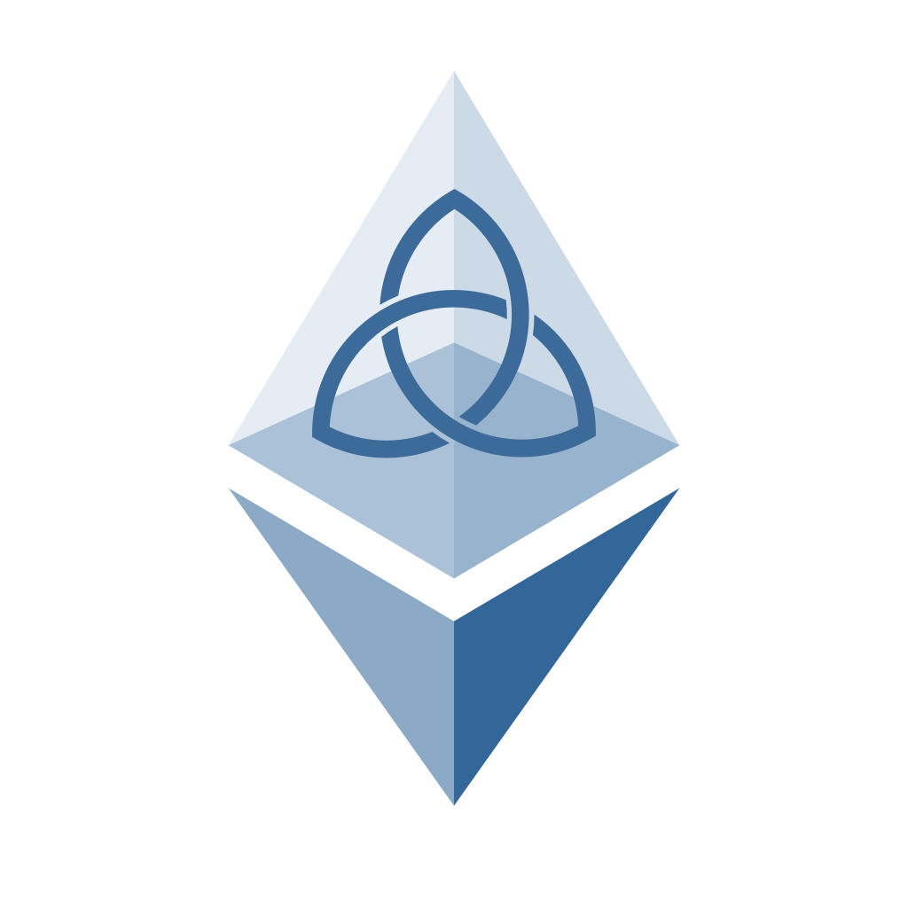

.. Ethermint documentation master file, created by
   sphinx-quickstart on Mon Aug  7 04:55:09 2017.
   You can adapt this file completely to your liking, but it should at least
   contain the root `toctree` directive.

Ethermint
=========

Introduction
============

.. toctree::
   :maxdepth: 2

   introduction/what-is-ethermint.rst

Getting Started
===============

.. toctree::
   :maxdepth: 2

   getting-started/install.rst
   getting-started/getting-started.rst
   getting-started/using-mist.rst

Testnets
========

.. toctree::
   :maxdepth: 2

   testnets/venus.rst

Architecture
============

.. toctree::
   :maxdepth: 2

   architecture/future-architecture.rst
   architecture/inter-blockchain-communication.rst
   architecture/peg-zones.rst
